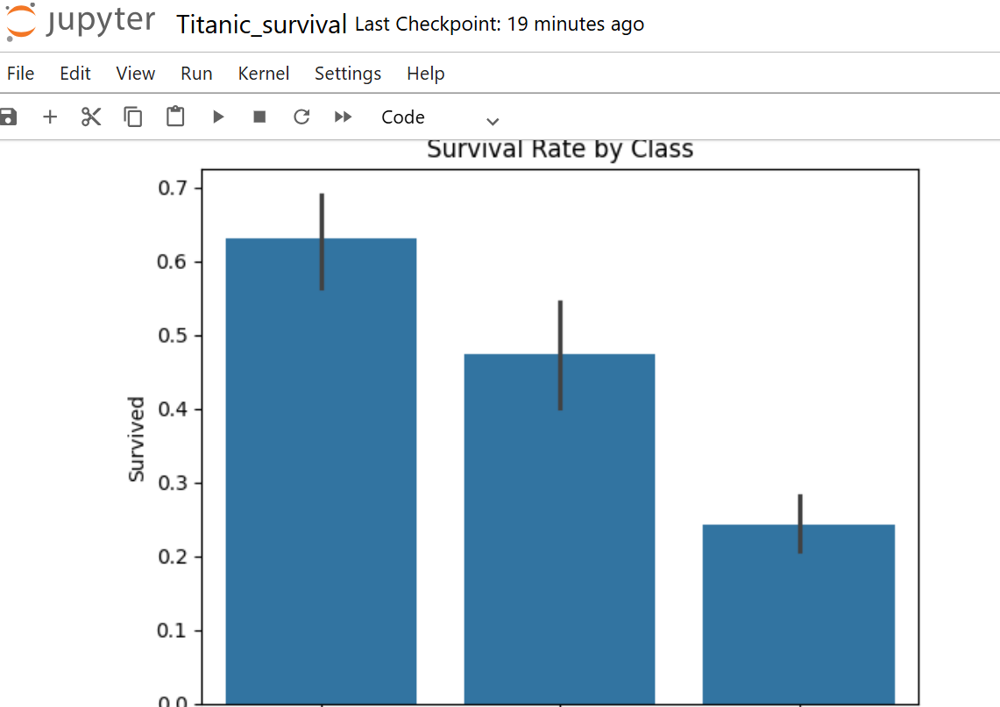

# Titanic Survival Analysis

Built and compared classification models to predict Titanic passenger survival, with full data cleaning, feature engineering, and model evaluation.



## What I Did
- Loaded and inspected 891 passenger records across 12 variables
- Handled missing values — Age (20% missing filled with median), Cabin (77% missing, dropped)
- Engineered features: FamilySize, IsAlone, FareSqrt (skew reduction), one-hot encoded Embarked
- Trained and compared **Logistic Regression** and **Random Forest** classifiers
- Evaluated both models using Accuracy, Precision, Recall, F1, and ROC-AUC
- Visualised key survival drivers and Random Forest feature importances

## Key Findings
- Women survived at **74%** vs men at **19%** — the largest single factor in both EDA and model feature importance
- First-class passengers survived at **63%** vs third-class at **24%**
- Women in first class had a **97%** survival rate; men in third class had **13%**
- Sex was the dominant feature in the Random Forest model, followed by Fare and Pclass

## Model Performance (held-out 20% test set)

| Model | Accuracy | Precision | Recall | F1 | ROC-AUC |
|---|---|---|---|---|---|
| Logistic Regression | ~0.81 | ~0.79 | ~0.74 | ~0.76 | ~0.87 |
| Random Forest | ~0.83 | ~0.81 | ~0.76 | ~0.78 | ~0.89 |

*Scores are approximate — run the notebook to see exact values on your split.*

## Business Recommendation
The data shows rescue priority was determined by both gender and economic class, not capacity. The 97% survival rate for first-class women vs 13% for third-class men reveals a structured, socially-biased triage — not random chaos. Any emergency planning framework today should embed objective criteria to prevent social bias from determining who survives.

## Tools Used
Python · Pandas · Matplotlib · Seaborn · scikit-learn · Jupyter Notebook

## Setup
```bash
pip install -r requirements.txt
jupyter notebook Titanic_survival.ipynb
```

Run all cells in order (Kernel → Restart & Run All).

## Dataset
[Titanic dataset](https://www.kaggle.com/competitions/titanic) — Kaggle
